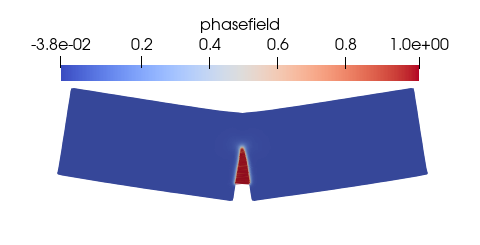
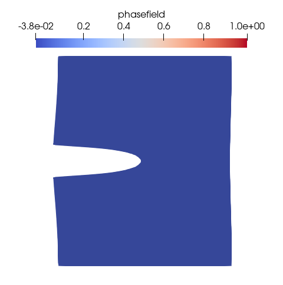
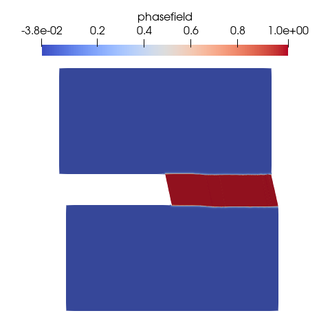
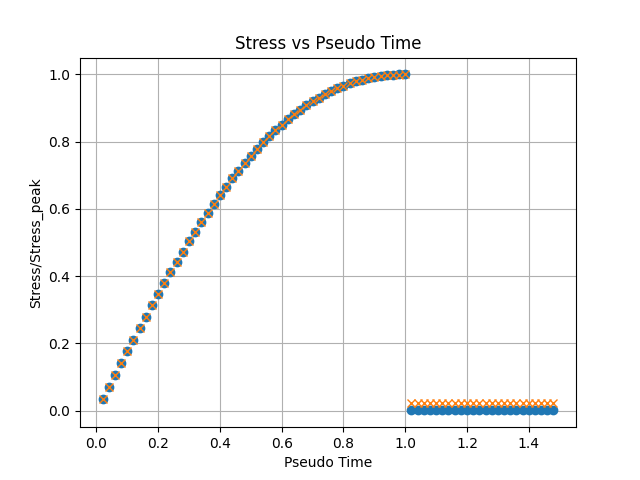

# phasefield-jr-py
### A branch for phasefield-jr project based on a centralized simulation system


The phase field method is a powerful tool for fracture analysis. However, it introduces certain challenges that are not encountered in traditional finite element analysis. With this in mind, this code was developed for educational purposes, providing a self-contained implementation to help researchers familiarize themselves with the fundamentals of phase field analysis. It also serves as a reference for verifying their own code.

The Python scripts in this repository are accompanied by a research paper that provides additional background, methodology, and results. You can read the paper here: [Link to paper](https://doi.org/10.1016/j.advengsoft.2025.104013).

Check out the sister code in C++ on:
[https://github.com/nathanshauer/phasefield-jr](https://github.com/nathanshauer/phasefield-jr)

For more information about me or to get in touch, please visit my website:
[www.nathanshauer.com](http://www.nathanshauer.com)

Phasefield-jr has been extended to use an L-BFGS solver with line search and is available at: [https://github.com/gfemuillinois/BORAM](https://github.com/gfemuillinois/BORAM)

A simplified version that assumes only tensile loads is available on the branch pure-tensile: [Pure-tensile branch on GitHub](https://github.com/nathanshauer/phasefield-jr-py/tree/pure-tensile). The preprint of the accompanying paper that also assumes only tensile loads is available at: [Link to paper preprint](https://www.researchgate.net/publication/392664425_Less_than_500_Lines_Self-Contained_Python_Finite_Element_Implementation_of_the_Phase-Field_Method_for_Fracture_Mechanics)

> **Note:** the code has since evolved from the original phasephield-jr layout into a centralized simulation system (see below). The examples described in the accompanying papers correspond to the pre-configured simulations `example_1_simplebar`, `example_2_notchedplate`, `example_3_bendingtest` and `example_4_shear` described in this document.

## Configuration

The code has been tested on macOS and Ubuntu.

### Installing Python, numpy, scipy, matplotlib and meshio

To run the code, you need to have Python, numpy, matplotlib and meshio installed on your system. Scipy is also needed for the sparse-matrix routines used internally by the solver, and `meshio` is required to read the Gmsh mesh files (`.msh`) used by the simulations. Follow these steps to install them:

1. **Install Python**: If you don't have Python installed, download and install it from the [official website](https://www.python.org/downloads/). You can also install Python using a package manager in Linux or macports/homebrew in macOS. **The code was tested using Python 3.12**

2. **Install the dependencies**: Open a terminal and run the following commands to install numpy, scipy, matplotlib and meshio using pip:

```sh
pip install numpy scipy matplotlib meshio
```

3. **Verify installation**: To ensure that the packages are installed correctly, you can run the following commands in a Python shell:

```python
import numpy
import scipy
import matplotlib
import meshio
print(numpy.__version__)
print(scipy.__version__)
print(matplotlib.__version__)
print(meshio.__version__)
```

If the versions are printed without any errors, the installation was successful.

## Running the code

The simulations are no longer set up as separate standalone scripts. Instead, `phasefieldjr.py` is the single entry point (the phase-field solver), and each simulation is described by its own configuration file inside the `simulations` folder. This makes it possible to add new simulations without touching the solver or the configuration-loading code.

- **`config_simulations.py`**: defines all data structures (`SimulationConfig`, `MaterialParameters`, etc.) and the loader functions. It does **not** contain any simulation data itself.
- **`simulations/<name>.py`**: each file defines exactly one simulation through a module-level `CONFIG` variable.
- **`phasefieldjr.py`**: the phase-field solver. Its `main(config_name)` function loads the requested configuration, builds the mesh/material/BCs, and runs the staggered elasticity/phase-field scheme.

To run any example, open a terminal, navigate to the project directory, and execute:

```sh
python phasefieldjr.py <example_file>
```

Replace `<example_file>` with the desired simulation name (e.g., `example_1_simplebar` or `example_2_notchedplate`). Note that, unlike before, this is the *name of the configuration* (matching a file in `simulations/`), not the path to a `.py` script. Under the hood, `phasefieldjr.py` calls `get_simulation_config('<example_file>')`, which uses `importlib` to load **only** the corresponding `simulations/<example_file>.py` file and return its `CONFIG` variable — no other simulation file is ever imported or executed.

If no argument is given, `config_name` defaults to `'default'`, which does not exist, and the run fails with a clear error message listing what is available. Always pass an explicit simulation name.

All examples will generate output files in the `outputs` directory, which can be visualized using ParaView as described in the "Output in Paraview using vtk files" section.

### Pre-configured simulations

1. **`example_1_simplebar`**: Simulates a bar under tension.
2. **`example_2_notchedplate`**: Simulates a single-edge notch plate under tension.
3. **`example_3_bendingtest`**: Simulates a 3-point bending test.
4. **`example_4_shear`**: Simulates a notched plate under shear.

### Adding a new simulation

Create a new file inside `simulations/` defining a `CONFIG` variable (a `SimulationConfig`) with the material parameters, boundary conditions, and solver settings you want; `config_simulations.py` does not need to be modified. You will also need to generate the `.msh` mesh file for your simulation using Gmsh and place it inside `simulations/`.
```python
# simulations/my_simulation.py
from config_simulations import (
    SimulationConfig, MaterialParameters,
    BoundaryCondition, GraphConfig, ReactionConfig
)

CONFIG = SimulationConfig(
    name='My Simulation',
    mesh_file='my_mesh.msh',
    mesh_type='gmsh',
    material=MaterialParameters(
        E=30.0, nu=0.2, Gc=1.2e-4, l0=10.0, length=200.0,
        material_type='plane_stress'
    ),
    boundary_conditions=[
        BoundaryCondition(name='base', node_filter=10, bc_type=0, xval=0.0, yval=0.0),
        BoundaryCondition(name='top',  node_filter=20, bc_type=1, xval=0.04, yval=0.0),
    ],
    simulation_params={
        'dt': 0.01,
        'totaltime': 1.0,
        'maxsteps': int(1e5),
        'maxiter': 500,
        'stagtol': 1e-4,
        # 'nthreads': 4,  # optional: override the system-detected thread count
    },
    output_base='outputs/my_sim_',
    imposed_displacement=0.04,
    graph_config=GraphConfig(
        graph_type='force_vs_displacement',
        output_file='outputs/my_sim_force_vs_u.png',
        x_label='u (mm)', y_label='Force (kN)',
        title='Force vs imposed u',
        displacement_axis='x',
    ),
    reaction_config=ReactionConfig(
        reaction_type='bottom_ids_x',
        reaction_dof=0,
        sign_factor=-1.0,
    ),
)
```

 The new simulation will then be runnable with:

```sh
python phasefieldjr.py my_simulation
```

and will appear automatically when listing available simulations (`list_available_simulations()`).


## Utility Functions

You can view all available examples and get the parameters of any of them by running the `config_simulations.py`:

```python
if __name__ == "__main__":
    from config_simulations import get_simulation_config, list_available_simulations

    # Lists all available simulations 
    for name in list_available_simulations():
        print(name)
    # Load a specific configuration 
    config = get_simulation_config('example_1_simplebar')
    print(f"Simulation parameters of {config.name}:\n {config.simulation_params}")
```

### Important implementation notes

- **Only `mesh_type='gmsh'` is currently supported.** Any other value raises a `ValueError`.
- **BC values scale with pseudo-time.** `applyBoundaryConditions()` multiplies `bc.xval`/`bc.yval` by `pseudotime` on every step, so the value in the config is effectively a *rate*, not a fixed target displacement.
- **`readGmshMesh()` returns `(nodes, elements, physical_groups)`**, where `physical_groups` maps each Gmsh physical tag to a list of node IDs. Boundary conditions are attached to nodes either by referencing a Gmsh physical tag or, when needed, by geometric filtering.
- **Thread count is system-aware.** By default the solver reserves 2 CPU cores for the OS and uses the rest; this can be overridden per simulation via `'nthreads': N` in `simulation_params`.

## Output in Paraview using vtk files
To visualize the output in ParaView using VTK files, follow these steps:

1. **Generate VTK files**: After running the examples, VTK files will be generated in the `outputs` directory. These files contain the simulation results and can be visualized using ParaView.

2. **Install ParaView**: If you don't have ParaView installed, you can download it from the [official website](https://www.paraview.org/download/).

3. **Open ParaView**: Launch ParaView on your system.

4. **Load VTK files**:
  - Click on `File` > `Open`.
  - Navigate to the `outputs` directory of the project.
  - Select the VTK file you want to visualize (e.g., `output_ex1_#.vtk` or `output_ex2_#.vtk`).
  - Click `Apply` to load the data.

5. **Visualize the data**: Use the various visualization tools in ParaView to explore the simulation results. You can adjust the display properties, apply filters, and create animations to better understand the phase field analysis.

Below are example images illustrating the phase-field variable for the notched plate under tension (example 2), shown at the onset of fracture and after fracture has occurred.

<p align="center">
  
  
</p>

## Quantitative analyses

The project includes quantitative analysis of the simulation results, driven by each simulation's `graph_config`. At the end of each run, the analysis is performed, and the results are saved as PNG files in the `outputs` directory.

1. **Analysis of Bar under Tension (`example_1_simplebar`)**
  - Generates a plot of `sigma/sigma_peak x time`, where `sigma_peak` is calculated analytically.
  - Saved as `outputs/ex1_stress_vs_timeSimpleBar.png`.

2. **Analysis of Single-edge Notch Plate under Tension (`example_2_notchedplate`)**
  - Generates a plot of `Reaction force x imposed displacement`.
  - Saved as `outputs/ex2GEN_force_vs_u.png`.

3. **Analysis of 3-Point Bending Test (`example_3_bendingtest`)**
  - Generates a plot of `Reaction force x imposed displacement`.
  - Saved as `outputs/Bending_force_vs_u.png`.

4. **Analysis of Notched Plate under Shear (`example_4_shear`)**
  - Generates a plot of `Reaction force x imposed displacement`.
  - Saved as `outputs/ex4_force_vs_u.png`.

To view the analysis results, navigate to the `outputs` directory after running the simulations and open the respective PNG files.

Below is an example output from Example 1, illustrating the expected results. The plot shows the simulated stress (blue curve) compared with the analytical stress calculated from the phase-field value (yellow curve):

<p align="center">
  
</p>
